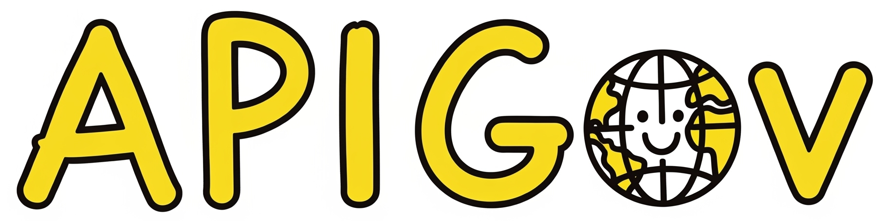

    

##  APIGov <small>(alpha)</small>
#### Manage API dependencies and schema governance

This app tracks dependencies between microservices at field-level, allowing detection of breaking changes and easing initial mapping.

## Capabilities
- **Schema Manipulation**: Define input/output schemas on the JSON editor or visually on a table, keeping both synchronized
- **Dependency Analysis**: Track which components consume data from others
- **Visual**: Generate basic graphs describing the relationships between APIs
- **Import/Export**: JSON-based configuration for easy backup and sharing

## Screenshots

## Stack
- **Framework**: Electron 35.0.0
- **Visualization**: D3.js for graphs, Excalidraw for diagrams
- **Styling**: TailwindCSS + DaisyUI
- **Storage**: Local JSON database

---

### TODO:
- Refactor to improve code quality and better adaptation to Electron's architecture
- Allowing importing/exporting directly from/to files
- Integrate with GitHub repositories to allow collaboration
  - Semantic JSON merging
